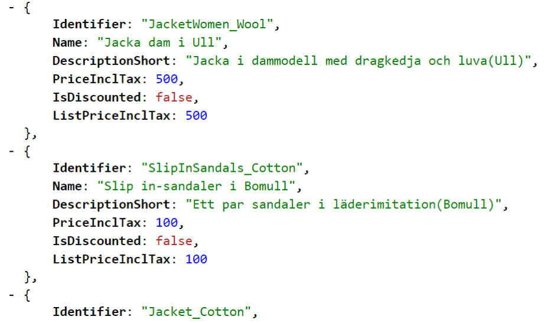
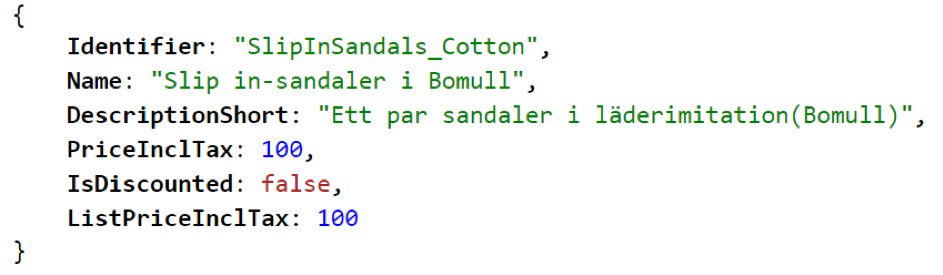
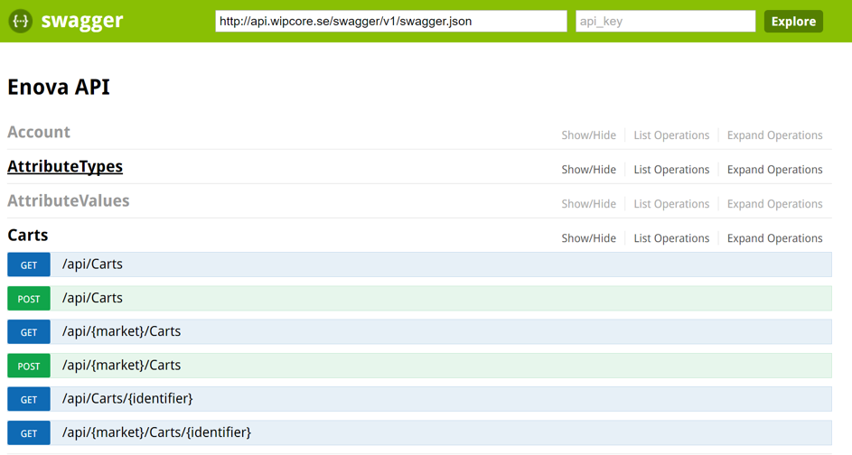
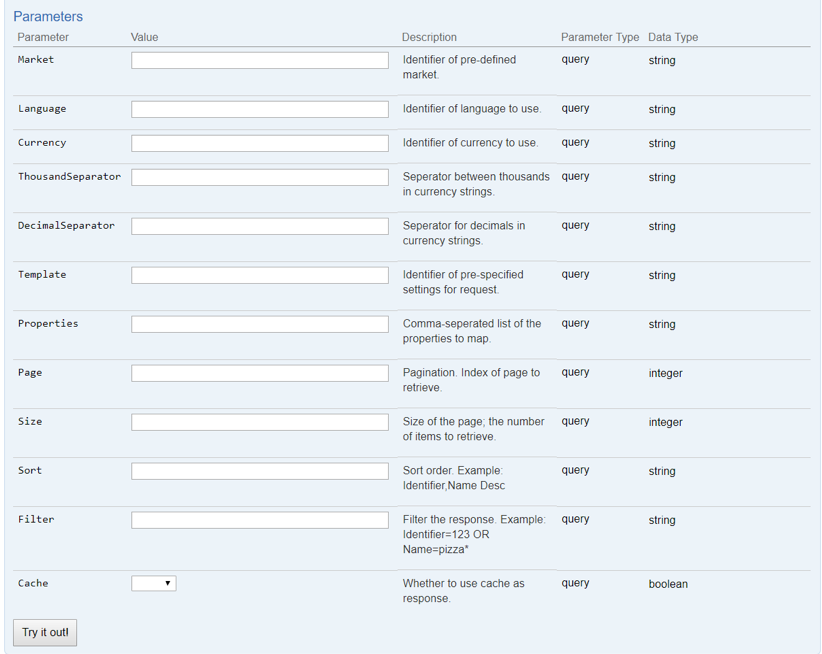
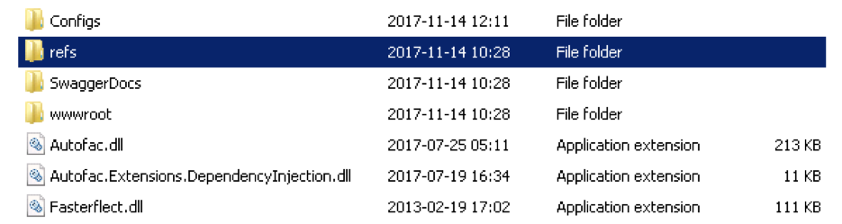

# Wipcore eNova API

- Contents
- [Overview](#overview)	3 
    - History	3
    - Purpose	3
    - Technology	3
- Using the API, Query	4
    - A simple example	4
    - Discoverability with Swagger	5
    - Filtering	6
    - Sorting	6
    - Paging	6
    - Selecting properties	6
    - Special properties	6
    - Language	7
    - Currency	7
    - Market	7
    - Culture settings priority	7
    - Request template	8
- Using the API, Cart	9
    - Request model	9
    - Example request	10
    - Response model	11
- Using the API, Order	12
- Using the API, Customer	12
    - Running the API	13
    - Folder structure	13
    - Quick start	13
    - IIS	13
    - Configurations	13
    - Diagnostics	15
- Authentication	16
    - Login	16
    - Authentication cookie	16
- Extending the API	17
    - Adding a custom computed property	17
        - IPropertyMapper	17
        - ICmoProperty	17
    - Modifying API behaviour	17
    - Creating new resources	17
    - Changing Autofac registrations	18


## Overview
This document is the primary documentation of the Enova API, up to beta2 (2017-11-14). This current version supports creating, updating and querying for most sorts of Enova objects.
### History
**2017-11-14**: Major Update, new parameters, order and cart handling etc  
**2016-07-07**: Initial version  
### Purpose
The purpose of the API is to provide an easy way to work with the Enova system. The API works as a RESTful web service that receives and answers in JSON. Compared to previous methods of accessing Enova (including in-process and .NET remoting), there are several advantages with using this API. First among them is that working through the API to build ecommerce websites separates the logic of ecommerce from the presentation, and lets these different parts be developed independently. Thus the same logic (through API-calls) can be reused for integration, administration, for building mobile clients and for any other purpose. Additionally, the API can load objects into memory once for faster processing and then serve them to any and all clients, which allows the clients to restart independently and quickly. Finally, the Enova API can be scaled to serve a specific load without affecting other parts of the system.   

In short the API is meant to provide
- Low coupling to other systems.
- Support for many different type of clients.
- High scalability.

### Technology
Enova API is built upon
- Enova 6.4
- ASP .NET Core 2.0
- Autofac 4.6
- MVC 6.0
- NLog 4.4
- Swashbuckle 1.0


## Using the API, Query

### A simple example
The architecture of the API is straightforward; Enova types are mapped to resources that are easy to access. Products for example are mapped to /api/products, thus retrieving products can be done with a simple get request. Assuming the API is setup to answer under api.wipcore.se, this could be a request and response:
```
GET: http://api.wipcore.se/api/products
```

 
To access **a single item**, write the identifier after the resource: 
 ```
 GET http://api.wipcore.se/api/products/slipinsandals_cotton
 ```
 
 
### Discoverability with Swagger
Other Enova resources can be accessed in a similar manner as products in the example above. To find out which requests are possible, go to URL api.wipcore.se/swagger/ . Swagger is a 3rd party component that documents the API. 

 
Above one can see a list of resources. Opening one shows a list of operations. Opening an operation shows a list of parameters and a button to try a request. Many of the parameters are the same for all requests.


### Filtering
The API provides a limited filtering capacity for simple requests; more advanced filters are better handled in specialized search engines, for example Elastic Search. Basic properties can be filtered on, example: **/api/products?filter=Name=jacket\*** will filter out all products with names that start with jacket. Nested properties can also be filtered upon: **/api/products?filter=DefaultSection.Name=Shoe\*** will filter out products that has a default section whose name starts with Shoe. The following operations can be used in a filter: **\>, \<, \>=, \<=, =, \<\>, \***.
Filters can be combined with AND or OR: **/api/products?filter=DefaultSection.Name=Shoe\* AND Name=NiceBoots**
Note: properties that exists on the item directly (for example as a column in the database) can be filtered on, while computed properties that are calculated for every request might not always work. See section about extensions, IPropertyMapper and ICmoProperty as well as special properties below.

### Sorting
Sorting works much like filters. For example **/api/products?sort=Name** sorts products according to name, while **/api/products?sort=Name desc** sort the products in the opposite order. **/api/products?sort=Name,Identifier** sorts first on Name, then on Identifier.

### Paging
If the response contains many products, paging might be needed. The **size** parameter specifies how many items should be returned in each chunk, while the **page** parameter specifies which numbered page to return. **/api/products?size=20&page=2** would return products 20-40 in a list, for example.  
The total number of objects, total number of pages, and links to the next/previous page of objects are included in the response headers.

### Selecting properties
The **properties** query parameter can be included to shape what data will be sent back in the response. **/api/products?properties=Name,Identifier,DescriptionShort** will return the three named properties. 
It is also possible to add more properties to the standard result by using the operator + in this way: **/api/products?properties=+DescriptionShort** which will include DescriptionShort as well as default properties in the response. 
To see all available properties, type: **properties=_all**  . Note: requesting this many properties might be slow, so it is only recommended for discovery purposes. 

### Special properties
Besides properties directly on the objects (like Name,Identifier etc.), there are also computed properties that can be used. Here follows a list of such properties, but note that more can be added through extensions as needed. Many of these properties can also be used when saving objects.

**IsDiscounted** – true if a product has a higher price on a pricelist marked as default, compared to the current price for the user.  

**ListPriceExclTax / ListPriceInclTax** – Price of a product on a pricelist marked as default, with or without tax.  

**PriceInclTax / PriceExclTax** – Price of a product for the current user, with or without tax.  

**Promos** – A dictionary of (identifier,name) of any promos directly related to a product. _NOTE: Cannot be used in a filter or for sorting_.  

**TotalStock** – Total stock of the product in all compartments. _NOTE: use URL /api/products/myproduct/stock for more stock information_.  

**TotalReserved** – Total reserved stock of the product in all compartments. _NOTE: use URL /api/products/myproduct/stock for more stock information_.  

**IsOwner** – True if a product is a variant family owner.  

**VariantOwner** – Identifier of any variant owner of a product.  

**Attributes** – Information of any attributes connected to the item. One can also use URL /api/products/myproduct/attributes for information about a products attributes. _NOTE: cannot be used in a filter or for sorting_.  

**SumInclTax** – The total price of a cart or order, with or without tax.  

**PricesInclTax / PricesExclTax** – Dictionary of (product-identifier, price) for all products on a pricelist, with or without tax.  

And many more.


### Language
There are several ways to set which language Enova will use when handling requests. Highest priority is given to the language parameter, where the desired language identifier can be specified like this: **/api/products?language=en** which will return products mapped with the English language.  
If the parameter is not set, then the language of the logged in user will be used. If no user is logged in, then the default language for the market will be used. See sections covering login and market configurations.

### Currency
Setting a currency works by the same rules as setting a language. **/api/products?currency=euro** would return products with prices given in euros.  

### Thousand Separator
This can be set to specify how thousands in a price string should be separated. Set it to ‘,’ for example to get a thousand as 1,000. Or set to ‘.’ To get 1.000.  

### Decimal Seperator
This works like the thousand separator, except it sets the separator for decimals instead. One and a half can be presented as 1,5 or 1.5, for example.


### Market
As noted above; language, currency and other culture information can also be specified by market. To select such a market configuration, add the identifier of the market to the query: **/api/products?market=sv**. The identifier matches the market specified in marketConfiguration.json. 

### Culture settings priority
As noted under the language section, when the API determines language, currency, etc., it prioritizes like this:
- If the setting is present in the request (I.E. language=sv), then use this setting.
- Otherwise, if a customer or admin is logged in, use the settings saved on that user.
- Otherwise, if a market is specified in request, use settings from that market.
- Otherwise, use settings from “default” in market configurations. 

### Request template
Often the same request is repeated many times. For example, every time someone goes to a certain product page, a similar request for products will likely be sent to the API. It is possible to save templates for such requests and refer to the identifier of that template, rather than specifying all parameters for every request. **/api/products?template=price** would select the price template, as specified in templateConfigurations.json.  

The template can specify many of the parameters described above, including **properties, filter, sort, page, size**.  

Note: If the parameter is explicitly given then it overrides any template. **/api/products?template=price&size=30** would always use size 30, regardless of what is written in the template.

### Cache
By default the API will cache identical requests until such a time as the data requested is changed. Asking for 20 products twice will return the response from the cache the second time, as an example. When a product is modified though, all cache for the product resource will be dropped so that the fresh result can be returned at the next request.  

If cache is not desired for a specific request it’s possible to turn it off by adding cache=false. I.e: /api/products?cache=false.  

“x-cache” in the response header notifies the client if the result was found in the cache or not.


## Using the API, Cart
### Request model
To create a cart, send a put request to **/api/carts**. A cart might look like this:
```json
{
"Identifier":"unittestcartNoSave",
"CustomerIdentifier":"69990002",
"ProductCartItems":[
{
       "ProductIdentifier":"GF_GPU_880",
       "Quantity":1,
       "MarkForDelete":false,
       "Comment":""
},
{
      "ProductIdentifier":"KarinkjolenArtikel",
      "Quantity":6,
      "MarkForDelete":false,
      "Comment":""
}
],
"NewShippingType":"OrdinaryShipment",
"NewPaymentType":"InvoicePaymentIdentifier",
"PromoCode":"kjol"
}
```
Most of these parameters are optional; there is no need to specify cart items that are not needed. Many carts might contain nothing but product rows. 

A request such as the one above could be to create a new cart, or it could mofidy an old cart. To remove a cart item from an already existing cart, use NarkForDelete = true for the row.

In response to the request above, the server might respond with the following:
```json
{
"Identifier":"unittestcartNoSave",
"CustomerIdentifier":"69990002",
"ProductCartItems":[
{
     "ID":0,
     "ProductID":443023,
     "Identifier":"",
     "ProductIdentifier":"GF_GPU_880",
     "PriceExclTax":5000,
     "PriceInclTax":6250,
     "PriceExclTaxString":"5 000,00 kr",
     "PriceInclTaxString":"6 250,00 kr",
     "TotalPriceExclTaxString":"5 000,00 kr",
     "TotalPriceInclTaxString":"6 250,00 kr",
     "Quantity":1,
     "Comment":"",
     "Name":"Geforce 880"
},
{
     "ID":0,
     "ProductID":5704,
     "Identifier":"",
     "ProductIdentifier":"KarinkjolenArtikel",
     "PriceExclTax":160,
     "PriceInclTax":200,
     "PriceExclTaxString":"160,00 kr",
     "PriceInclTaxString":"200,00 kr",
     "TotalPriceExclTaxString":"960,00 kr",
     "TotalPriceInclTaxString":"1 200,00 kr",
     "Quantity":6,
     "Comment":"",
     "Name":""
}
],
"PromoCartItems":[
{
     "ID":0,
     "PromoID":443005,
     "Identifier":"",
     "PromoIdentifier":"Kjol Promo",
     "PriceExclTax":-160,
     "PriceInclTax":-200,
     "PriceExclTaxString":"-160,00 kr",
     "PriceInclTaxString":"-200,00 kr",
     "TotalPriceExclTaxString":"-160,00 kr",
     "TotalPriceInclTaxString":"-200,00 kr",
     "Quantity":1,
     "Comment":"",
     "Name":""
}
],
"ShippingCartItem":{
     "ID":0,
     "ShippingID":5724,
     "Identifier":"",
     "ShippingIdentifier":"OrdinaryShipment",
     "PriceExlTax":50,
     "PriceInclTax":62.5,
     "PriceExclTaxString":"50,00 kr",
     "PriceInclTaxString":"62,50 kr",
     "Name":""
},
"PaymentCartItem":{
     "ID":0,
     "PaymentID":443131,
     "Identifier":"",
     "PaymentIdentifier":"InvoicePaymentIdentifier",
     "PriceExlTax":0,
     "PriceInclTax":0,
     "PriceExclTaxString":"0,00 kr",
     "PriceInclTaxString":"0,00 kr",
     "Name":""
},
"TotalPriceInclTax":7312.5,
"NewShippingType":"",
"NewPaymentType":"",
"PromoCode":""
}
```

As seen the server has applied the cart items, including payment, shipping and promos, and calculated the cost of each row and the full cart. It has also filled in more information such as the name of each cart item. 

Often there is a need to calculate the value of a cart without saving it to the database. Use the flag **calculateOnly=true** for this purpose. 

Retriving a cart is as simple as making a get request. By default ProductItems are returned, but it’s easy to get other cart rows as well by adding for example “PaymentCartItem” to the query string: **/api/carts/mycartidentifier?Properties=+PaymentCartItem**

## Using the API, Order
To create an order, make a put request to **/api/carts/createorder** with the model of your order, as specified under the cart section above. This request will return the ID of your new order. This ID can then be used to retrive the order with a get request: **/api/orders/mynewid**

Updates to already existing orders are limited; it is not possible to change what rows are included on the order. Instead the old order should be scrapped and a new order created, since this will preserve a copy of the original order. It is possible to update the order status of the order by the status property though. Example put:
```json
{
  "Identifier" : "myorder",
  "ShippingStatus" : "MyNewShippingStatus",
  ...
}
```

If a status is not specified when the order is first created, then the status **New_Internet** will be used. To change the default status, set the config value `EnovaSettings:NewShippingStatus` in appsettings.json (see section covering configurations).

It is also possible to update other direct properties on an order, such as FirstName. 

## Using the API, Customer
Creating or updating a customer is as simple as sending a put request to **/api/customers** with a dictionary of properties and values. Example:
```json
{
  "Alias": "halfman",
  "Password": "precious",
  "Firstname": "Bilbo",
  "Lastname": "Baggins",
  "Street": "Bag End",
  "City" : "Shire"
}
```

Other common properties are Email, Phone, CountryName, PostalAddress, PostalCode, RegistrationNumber, CoAddress, CompanyName, etc. If an identifier is not specified, then one will be generated for the new customer. 

Note: A new (not logged in) user can create a new customer (registration), but a customer cannot update any customer object that is not the same as the customer they are logged in as. 


## Running the API
### Folder structure
When published, the API will have a folder structure like this:

 
**Addin** – This folder contains any extensions to the API. Se extension section.  

**Configs** – This folder contains all config files. Se configuration section below.  

**SwaggerDocs** – This folder contains .xml documents with code comments, that are used to document the API in swagger.  

**wwwroot** – Contains web.config, which is usually empty. This is the folder IIS should be pointed to.  

### Quick start
To quickly start the API one can run Wipcore.Enova.Api.WebApi.exe in the root folder. By default, this will launch the API at [http://localhost:5000](http://localhost:5000). This is useful for testing.
### IIS
To setup the API to run with IIS, create a site that points to the wwwroot folder. The application pool should be set to **No Managed Code**.

### Configurations
All configurations for the API resides in the config folder. These are:

**NLog.config** – Configurations for nlog, the logging framework.  

**marketConfiguration.json** – Settings for culture values which can be referenced in requests, see market parameter.  
Example:
```json
 {
  "default": {
    "language": "sv",
    "currency": "sek",
    "taxrule": "STANDARD_TAX",
    "thousandseparator": ",",
    "decimalseparator": "."
  },
  "sv": {
    "language": "sv",
    "currency": "sek",
    "taxrule": "STANDARD_TAX"
  },
  "eu": {
    "language": "en",
    "currency": "euro",
    "taxrule": "STANDARD_EN"
  }
}
```
Specifying **sv** as the market used will give the values of **sv** for language, **sek** for currency and **standard_tax** for taxation rules. These are identifiers for the relevant objects in Enova. Any new markets can be added to this list. Default is used when no market is specified. Note that values for language and currency can be overwritten by query parameters as well as any values saved on the logged in user.

**templateConfiguration.json** – This file contains settings for how queries to the API should be handled. First the type of object is specified, for example EnovaBaseProduct. When the API reads the configuration it will look first for the specific type it is handling, but if that is not found it will look for base types. Thus if handling WebfoundationProduct it will look first for settings for WebfoundationProduct and then for EnovaBaseProduct, and so on.  
Then the name of the template is specified, which matches the template query parameter. Default is used for when no template name is specified. Under this, settings for query parameters are specified, which will be used when no explicit parameters are given. See [Using the Api, Query](#using-the-api--query) for more information.   
Example:
```json
{
    "enovabaseproduct": {
        "default": {
        "properties": "Identifier,Name,DescriptionShort,PriceExclTax,PriceInclTax,
                        IsDiscounted,ListPriceInclTax"     
        },
        "price": {
        "properties": "Identifier,PriceExclTax,PriceInclTax,IsDiscounted,
                        ListPriceInclTax,ListPriceExclTax"
        }
    },
}
```
When querying products and asking for template price, the properties listed under price will be used. Other settings like sort, filter, page and size can also be specified, but are rarely as relevant as properties.  

**Systemsettings.xml** – This file contains settings for Enova, which in earlier versions were listed under the certificate in the registry.  

**Certificate** – The certificate is also placed here. The file is named by the key of the certificate.  

**Key-******.xml** – This is the key used to protect authentication cookies. If none exists a new key will be automatically generated.  

**Appsettings.json** – Settings for the API which are not covered by other files. Here the connection string to Enova is specified along with other Enova values such as log path. Other values:  
- `ApiSettings:PathToAddins` – Change the folder where addins reside.  
- `ApiSettings:PathToSwaggerDocs` – Change the folder where swaggerdocs reside.  
- `ApiSettings:UseSwagger` – True or false to enable or disable swagger. Defaults to true. 
- `EnovaSettings:NewShippingStatus` – Set the default new shipping status for new orders.  
- `Auth` – Settings for authentication, as described under authentication section.  
- `Cache` – Settings to enable or disable cache, as well as specify how long the cache should hold. Caching applies to all get requests for objects.   

**Localappsettings.json** – Settings in this file will override settings in appsettings.json and can be used to quickly change to a test environment, or to have different settings on a local development machine. This file should not be present in a production environment.  

**Customsettings.json** – Optional file. Add any settings here that are needed for addins to the API. 

### Diagnostics
When the system is running it is possible to get diagnostic information from it. 

Go to URL **/NodeInfo** for information about the EnovaNode/WipclusterPeer that the API is running. 

Go to **/IsEnovaAlive** to check Enova status – it returns true if the enova system has updated its heartbeat column in the WipClusterPeer database table during the last minute. 

Go to **/MonitorInfo** to get a list of performance data, such as total number of customer logins, number of sessions, number of SQL statements / second, and more. 

## Authentication
Many resources in the API are protected and require a valid login before they can be accessed. For example, listing customers and orders can only be done as an administrator, while a customer can only see orders, carts and other information that belongs to itself.

### Login
Login to the API by sending a post request to the Account controller. A login-request returns a status message and (if successful) the identifier of the user that has been logged in. It will also return the default language and currency of this user. In addition, it will return an **accesstoken** which can be resent by other applications for subsequent authorization.   

**LoginAdmin** – Login an EnovaAdministrator by alias and password.  

**LoginCustomer** – Login an EnovaCustomer by alias and password.   
Example:  
`POST /account/LoginCustomer`
```json
{
  "Alias": "Gollum",
  "Password": "precious"
}
```

**LoginCustomerWithAdminCredentials** – Login an EnovaCustomer by specifying the identifier of the customer and the username and password of an administrator.  

**Logout** by posting to /Account/Logout.  

**IsLoggedInAs** – Get information about the currently logged in user.  

### Authentication cookie
A successful login request will add an authentication cookie to the response header. This cookie should be sent back to the server on each request. If using a .NET http-client to login for example, then this client should be reused for subsequent requests for easy resending of the cookie. 
It is possible (but not necessary) to modify the settings for this cookie by adding values under “Auth” section in appsettings.json.  

**CookieName** – Change the name of the cookie.  

**CookieDomain** – Change the domain of the cookie.  

**SlidingExpiration** – Set true to enable sliding expiration for the cookie.  

**ExpireTimeMinutes** – Number of minutes before the cookie expires. Defaults to 120 minutes.  

**CookiePath** – Path of the cookie.  

**CookieSecure** – Set to true to deny any cookies sent without https. Recommended in   
**production** environment.   

**CookieHttpOnly** – Set to try to deny cookie access in javascript.   

**UseDpapiProtection** – Protects the encryption key so that it can only be read by the  
 windows user who generated it. Requires windows 2012 or later. Set to false to disable this security.


## Extending the API
There are several ways to modify or add to the functionality of the API. All modifications should be built as .dll files and placed in the **addin** folder (see section covering folder structure). This includes standard Enova class extensions; for example WebFoundation.Core.Dll would be placed in this folder if WebFoundation is being used, as well as any custom product/order/cart/etc. type libraries.  

To modify the API it is recommended to reference `Wipcore.Enova.Api.Abstractions` for access to the interfaces and models that are used throughout the solution. To change the be behaviour of the API you might also need to reference `Wipcore.Enova.Api.Abstractions.Internal`.

### Adding a custom computed property
The easiest way to extend the API is to add a custom property, which could be used to provide non-standard functionality. This could be anything from address information that depends on non-standard fields, or prices that depend on non-standard links to suppliers/companies/other customers etc. To add such a property, implement the interface IPropertyMapper for retrieving and saving the property, and ICmoProperty to use the property for filtering and sorting.

### IPropertyMapper
Implement the interface by specifying the names of the handled properties (which might be several if the mapper handles more than one property), which Enova type it applies to, which priority it has (which can be used to override already written property-mappers), and if it maps to Enova, from Enova or both. Finally implement MapFromEnovaProperty and/or MapToEnovaProperty to specify the mapping logic. 
Compile the mapper into a .dll and place in addins as specified above, and the mapper will be loaded when the API restarts. 

### ICmoProperty
It is a bit more complicated to enable filtering and sorting of a custom property. Sorting and filtering must be done at cmo object level for optimal speed, which can be done by implementing the interface ICmoProperty (which resides in Wipcore.Core). This works much like IPropertyMapper except its logic is in the GetProperty method. 
Coding at cmo-level requires a firm understanding of Enova. Thus it might be a better idea to implement advanced filtering and sorting in another system, for example ElasticSearch.

### Modifying API behaviour
To change a certain aspect of the API, one can implement a specific interface and use that implementation instead of the default one. Implement IFilterService to change filtering behaviour, for example, or implement IProductService to change product logic, etc.  

As a rule, one cannot derive from the default classes and override its members, one must provide the full implementation in a new class. This is done to make the separation between base functionality and extension clearer, and to simplify future updates. However, it is of course possible to use the default ProductService in your own ProductService and pass on any calls to it when desired. 

### Creating new resources
To create a new resource, or a new implementation for a standard resource, one can create a new controller. It is recommended to derive from `EnovaApiController` as it handles context settings and exceptions, and to use `IContextService` to access an _EnovaContext_, but it is not strictly required. The custom controller can be given a path in the API with the route attribute:  
```csharp
[Route("api/[controller]")]
public class CustomProductController : EnovaApiController
```
The above controller will answer at **api/customproduct/**  
Place the new controller in **addin** as all other extension code.

### Changing Autofac registrations
By default, all types with names that end in Mapper, Model or Service, as well as all types that implement Controller, will be registered in Autofac. That includes types in **addin-folder**. If one desires greater control over registrations one can implement `IEnovaApiModule` and write custom registration code. It is possible to specify a priority on these modules. A higher number on the priority property will mean that the module is loaded after other modules with lower priority, which makes it possible to overwrite previous registrations. The default module has a priority of 0. 
